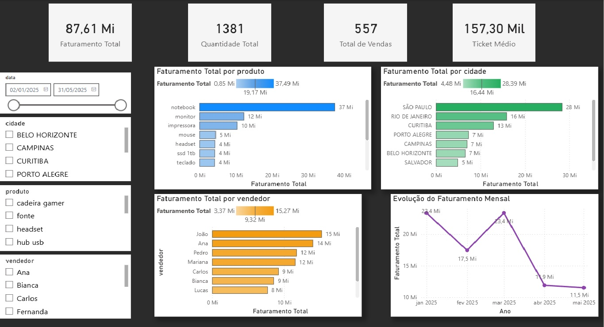

# Automação de Análise de Vendas

Projeto de portfólio com foco em automação de dados usando Excel, Python e Power BI.

## Objetivo
Automatizar o processo de tratamento e atualização de dados de vendas, permitindo que novos dados inseridos em planilhas Excel sejam processados por Python e refletidos em um dashboard no Power BI.

## Fluxo do projeto
Excel → Python (Pandas) → Dados tratados → Power BI

## Tecnologias utilizadas
- Python
- Pandas
- Excel
- Power BI

## Principais etapas
- Leitura de dados brutos em Excel
- Tratamento e padronização com Pandas
- Geração de base tratada
- Construção de dashboard com KPIs de vendas
- Atualização do painel após entrada de novos dados

## Indicadores do dashboard
- Faturamento Total
- Total de Vendas
- Quantidade Total
- Ticket Médio
- Faturamento por produto
- Faturamento por cidade
- Faturamento por vendedor
- Evolução mensal das vendas

## Dashboard do Projeto

Visualização dos principais indicadores de vendas gerados a partir do pipeline de dados automatizado.



## Estrutura do projeto
```text
dados_brutos/
dados_tratados/
scripts/
dashboard/
